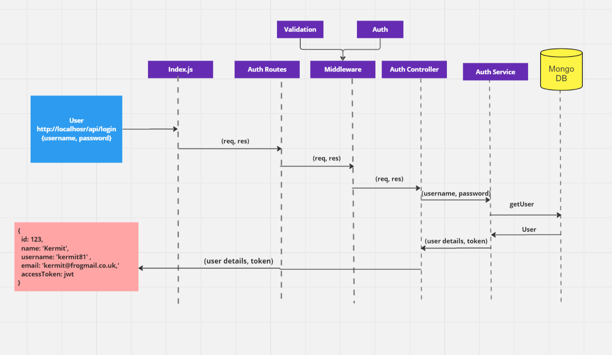
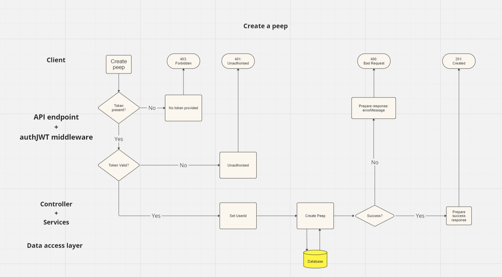
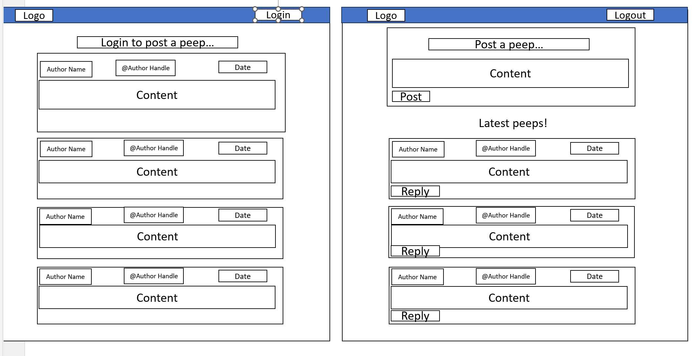
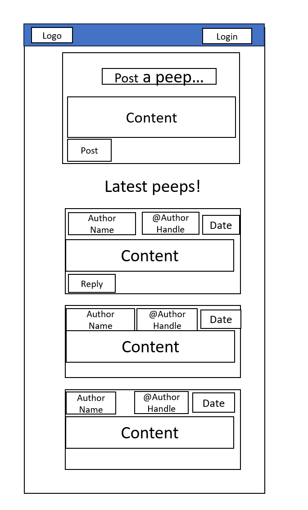
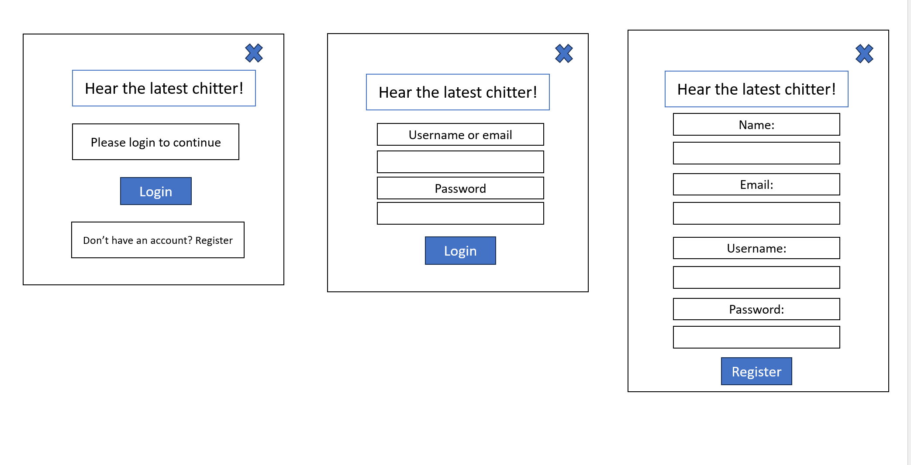
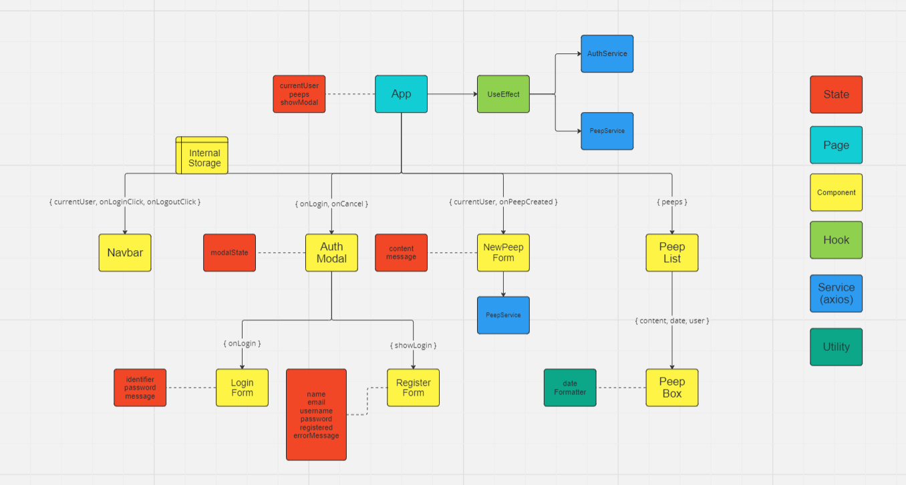
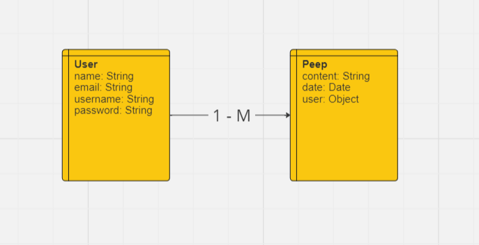

# Back-end diagrams:

# Wireframes:

## desktop screen - when looged in and logged out

## mobile screen 

## modal - conditional rendering of the following three:

# Component hierarchy diagram:

# Relationship diagram:
