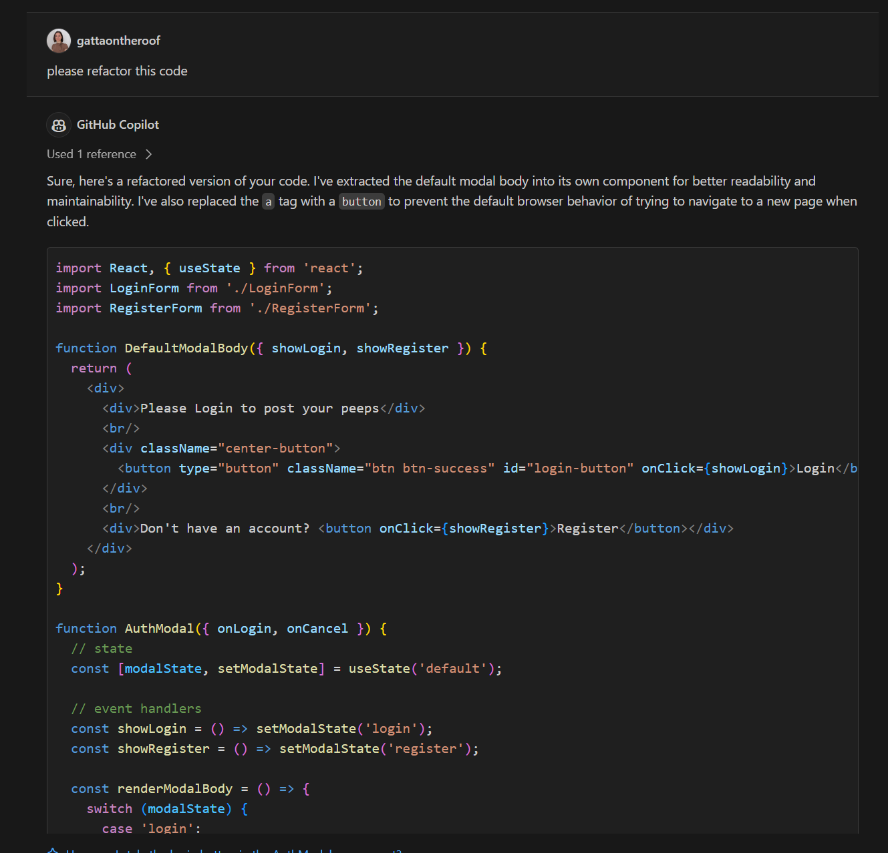
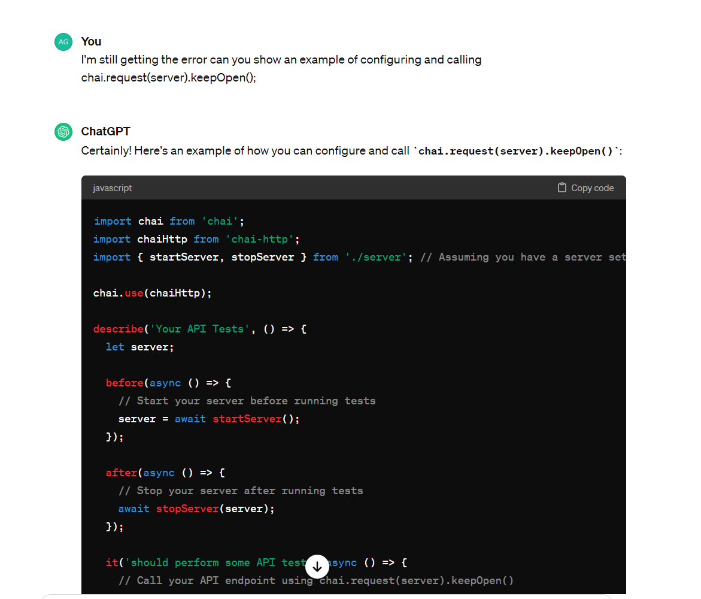
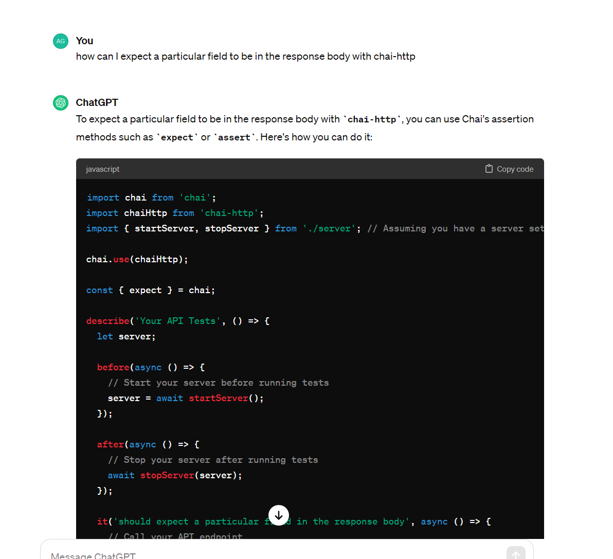

# Use of generative AI

The project utilised of generative AI for the following purposes:

## 1. Refactoring the code and making it more efficient - copilot in AuthModal.jsx

## 2. Writing test cases - copilot: 
- Navbar.test.jsx
- AuthModal.test.jsx

## 3. Debugging: chat gpt

## 4. Assistance with writing code and tests - chat gpt and copilot

